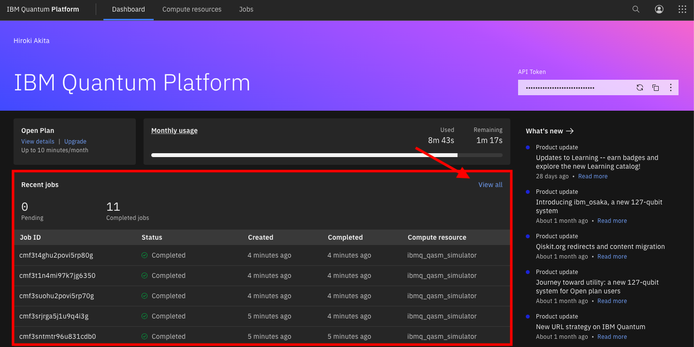
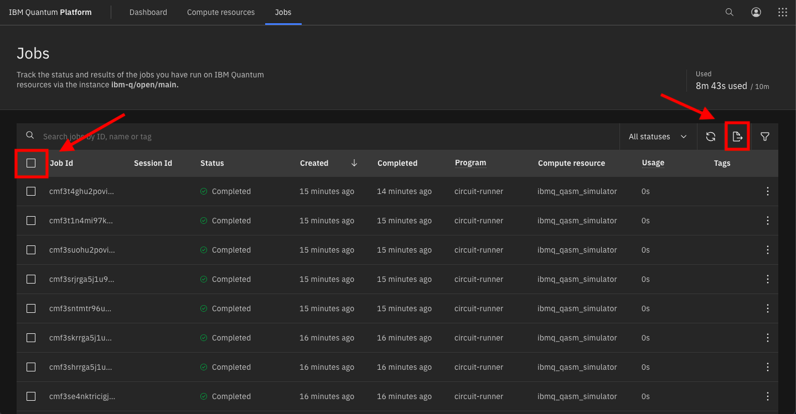
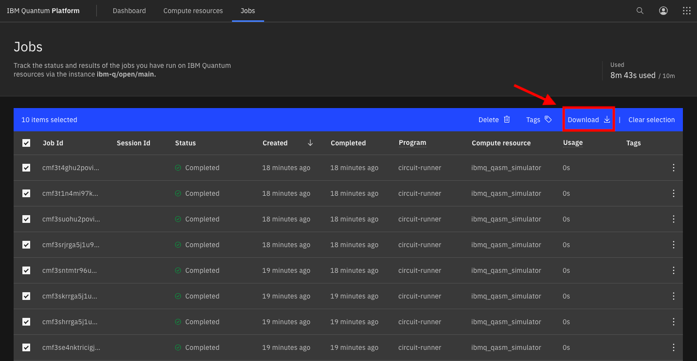

# 「巡回セールスマン問題に対するQAOA: $W$状態を用いた初期状態の改良とNISQ時代の挑戦」における実験リポジトリ
このリポジトリの説明.

## 実行環境のセットアップ
実験の環境を作る.

### ローカル環境のセットアップ
`pip`を使用する場合, リポジトリのターミナル上で以下のコマンドを実行する.

```
pip install --upgrade pip
pip install -r requirements.txt
```
### IBM Quantum Platformのアカウントの作成

[ホームページ](https://quantum.ibm.com/)より指示に従ってアカウントを作る.

## 各フォルダの詳細
フォルダごとの説明.

### config
実験におけるパラメータの管理をするJSONファイルのフォルダ.

- job_conf.json
    - ファイル名を変更したい実験結果データのフォルダのパス
        - "path": "../data/jobs/[*mode*]/[*optimizer*]/"の[*mode*]と[*optimizer*]を指定する
        - "opt": 実験番号を指定する
- meta.json
    - 実験時のパラメータを設定
        - "token": 「`******`」を自身のIBM Quantum PlatformのAPI Tokenに置き換える(***必須***)
        - "shots": 量子回路のshotsを指定する
        - "iterations": 量子回路のパラメータ更新の回数を指定する
        - "reps": Hamiltonianの時間発展の回数を指定する
        - "problem": 問題を指定する
            - "data_path": 扱う問題のパスを指定する
            - "num_cities": 扱う問題の都市数を指定する
        - "optimizer": 古典最適化器の種類を選択する
            - {"cobyla", "nelder-mead", "powell", "spsa"}
        - "mode": 実験方法を選択する
            - {"device", "simulation"}
        - "quantum_machine": "mode"が"device"のとき, 「`------`」を使用するマシンの名前に置き換える(***必須***)

### data
実験における問題を管理するTextファイルのフォルダ. また, 実験結果のデータを管理するJSONファイルのフォルダを内部に持つ.

- tsp_data.txt
    - 基準となる5都市のTSP
    - AOJの[DPL_2_A](https://judge.u-aizu.ac.jp/onlinejudge/description.jsp?id=DPL_2_A)の21番目のデータ
- tsp_data_3_cities.txt
    - `tsp_data.txt`より作成した3都市のTSP
    - 都市数が変わってもプログラムが正常に動くかの確認用

- jobs
    - device
        - cobyla
            - COBYLA最適化を使った実機実験の結果フォルダ
        - nelder_mead
            - Nelder-Mead最適化を使った実機実験の結果フォルダ
        - powell
            - Powell最適化を使った実機実験の結果フォルダ
        - spsa
            - SPSA最適化を使った実機実験の結果フォルダ
    - simulation
        - cobyla
            - COBYLA最適化を使ったシミュレーション実験の結果フォルダ
        - nelder_mead
            - Nelder-Mead最適化を使ったシミュレーション実験の結果フォルダ
        - powell
            - Powell最適化を使ったシミュレーション実験の結果フォルダ
        - spsa
            - SPSA最適化を使ったシミュレーション実験の結果フォルダ

### script
実験における実行プログラムを管理するPythonファイルのフォルダ.

- job_conv.py
    - IBM Quantum Platformに送信されたジョブのファイル名を書き換えるプログラム
- main.py
    - 実験を実行するメインプログラム
- utility_functions.py
    - 実験やファイル名の書き換えに必要な関数を全て管理しているプログラム
    - `main.py`に使われている関数
        - `input_tsp`
            - TSPのTextファイルから2次のコスト行列を生成する
        - `create_tsp`
            - 2次のコスト行列からTSPのインスタンスを作る
        - `w_cir`
            - $n$量子ビットの$W$状態を生成する
        - `create_init_state`
            - $W$状態を用いたQAOAの初期状態を生成する
        - `execution`
            - QAOAを実行する
        - `result_shower`
            - 実行された結果をターミナル上に表示する
    - `job_conv.py`に使われている関数
        - `get_job_list`
            - IBM Quantum Platformからダウンロードしたファイルの時刻情報から実行された順に並び替えた配列と, `job_conf.json`ファイルの指すディレクトリのパスを渡す
        - `txt_to_json`
            - ファイルの拡張子を`.txt`から`.json`に変える

## 実行方法
1. MasterResearchディレクトリからscriptディレクトリに移動する.
2. config/meta.jsonを適切に書き換えて保存する.
3. 次のコマンドを入力し, 実行完了まで待つ.
    ```
    python3 main.py
    ```
4. IBM Quantum Platformのマイページから実行した全てのデータとそれらの情報のまとまったCSVファイルを取得する.

    a. 画像赤枠の`View all`をクリック.
        
    
    b. 画像右赤枠のアイコンからCSVをダウンロード, 画像左赤枠のチェックボックスをつけて全てのデータにおいてcをする.
        
    
    c. 画像赤枠の`Download`でデータをダウンロード.
        
5. 4で取得した全てのデータをdata/jobs内の適切な場所に保存し, フォルダ名を実験番号にする.
6. config/job_conf.jsonを適切に書き換えて保存する.
7. 次のコマンドを入力し, 実行完了まで待つ.
    ```
    python3 job_conv.py
    ```